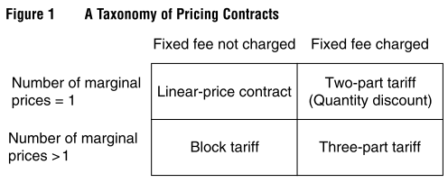
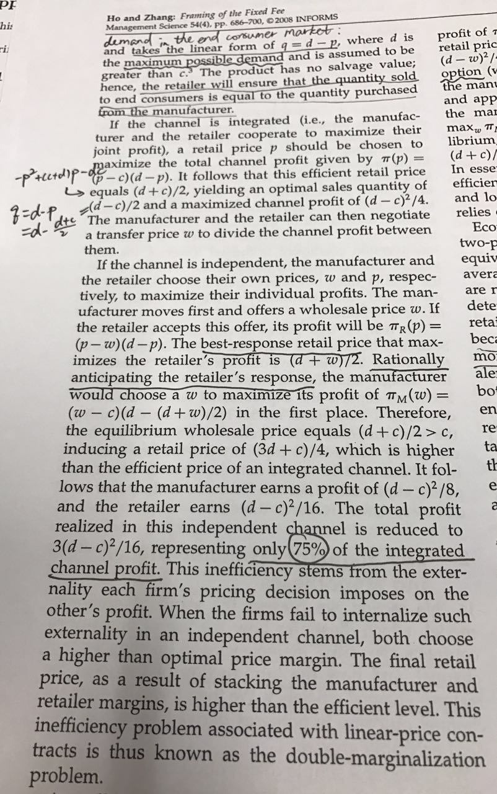
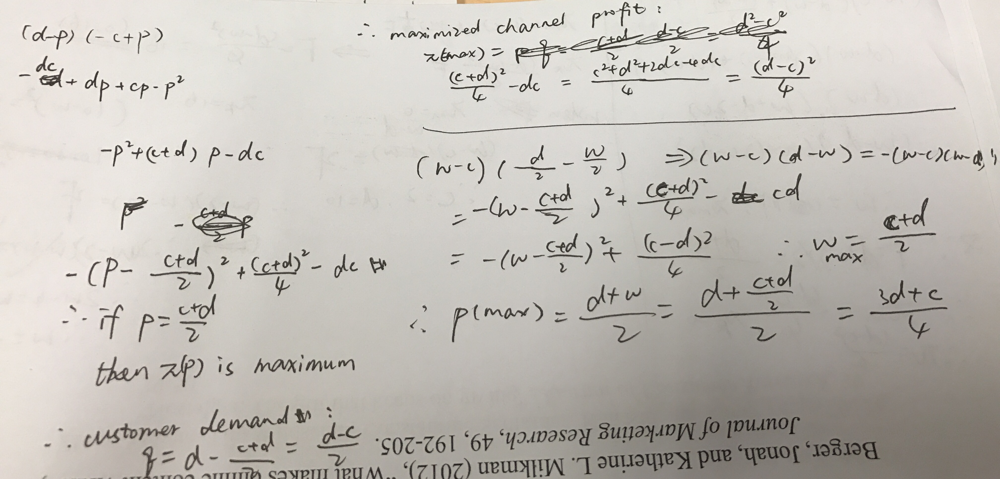
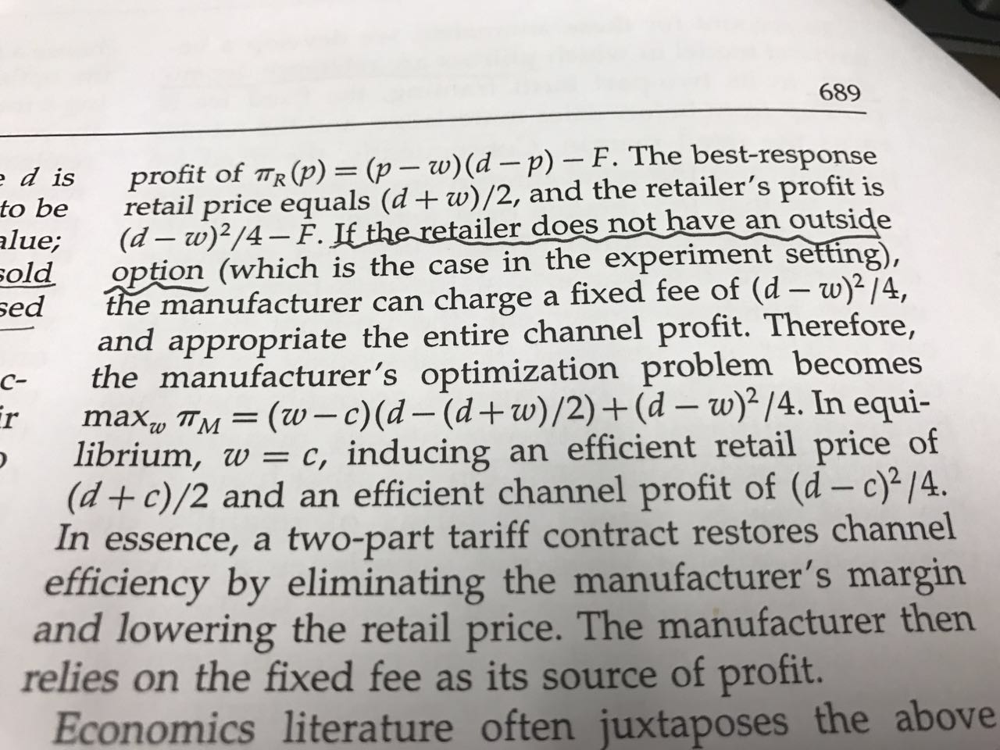
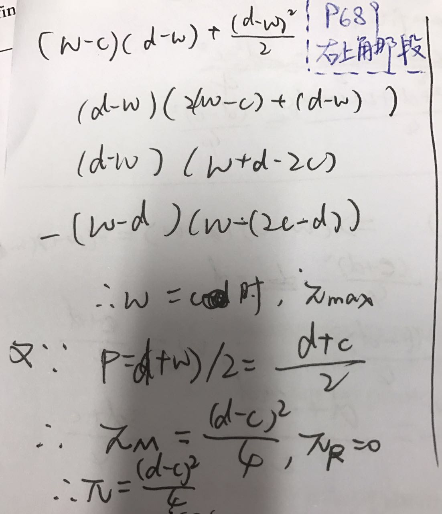
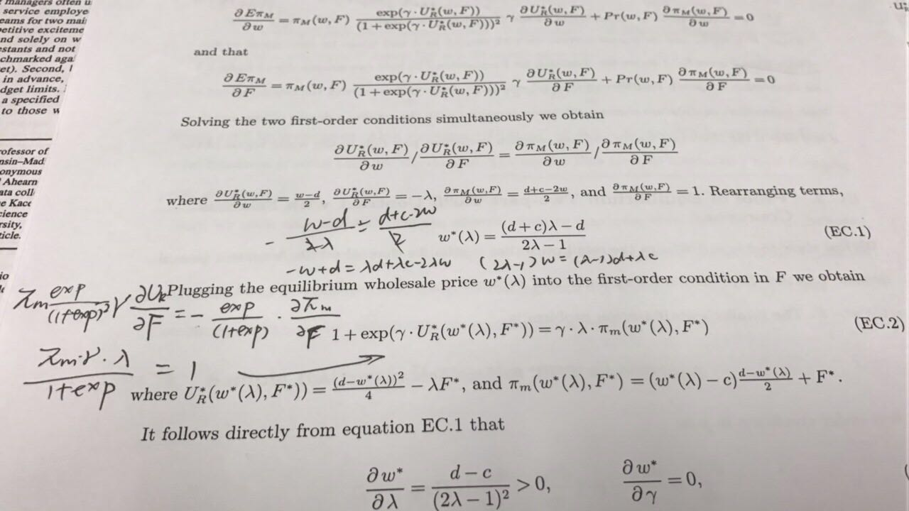
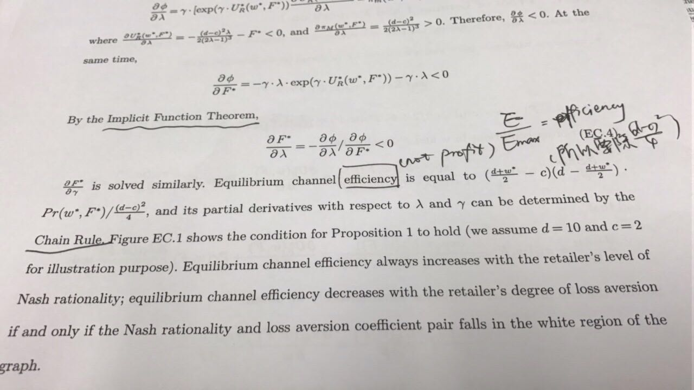

# Designing Pricing Contracts for Boundedly Rational Customers: Does the Framing of the Fixed Fee Matter?

Tags: summary

---

**Authors:** Teck-Hua Ho, Juanjuan Zhang

**Journal:** Management Science, 54 (4), 2008, pp.307–331

## 1. Introduction

### Context
manufacturer-retailer channel

### Standard economic theories
1. The introduction of the fixed fee restores channel
efficiency to the level of the **integrated channel**. (Channel efficiency **increases** with the introduction of the **fixed fee**)
2. Channel outcomes are invariant to the framing of
the fixed fee. Specifically, a two-part tariff and a quantity discount achieve the same channel outcomes.

**“Double-marginalization” problem**(Spengler 1950): 
This inefficiency occurs in an **independent channel** because neither firm takes into account the externality its pricing decision imposes on the other’s profit. Consequently, both charge a higher price than if they were part of the integrated channel.

### Phenomenon
1. The introduction of the fixed fee fails to increase channel efficiency. 
2. Moreover, the framing of the fixed fee does make a difference: an opaque frame as quantity discounts achieves higher channel efficiency than a salient frame as a two-part tariff, although these two contractual formats are theoretically equivalent.

### Improvement
1. **Reference dependent**. Generalize the standard economic model by allowing the retailer’s utilities to be reference dependent so that the up-front fixed fee payment is perceived as a loss and the subsequent retail profits as a gain. 
In two-part tariff framing, the up-front fixed fee can register as a loss and the subsequent retail proceeds a gain. These two mental accounts may thus be given different utility weights, as measured by the **loss-aversion coefficient**.
2. **Decision mistakes**. Embed this reference-dependent utility function in a **quantal response equilibrium framework** where the retailer is allowed to make decision mistakes due to computational complexity.

### Key prediction
Channel efficiency decreases with loss aversion for sufficiently Nash-rational retailers. 

loss aversion dominates complexity aversion in explaining the data.

## 2. The Standard Economic Model and Hypotheses

(Remain to be done)

## 3. 4. The Experiment and Results
1. These results conform to the expectation that the double-marginalization problem occurs when only a linear-price contract is used.
2. The two-part tariff and the quantity discount turn out to be no more efficient than the linear-price contract in coordinating the channel.
3. In sum, the data rejects the frame invariance hypothesis. The quantity discount contract generates higher channel efficiency than the two-part tariff overall, and gives the manufacturer a larger profit share.
4. There is minimal evidence of learning across the decision rounds.

## 5. A Behavioral Model
### 5.1 The Equilibrium Two-Part Tariff
Prove of Lemma 1 (Appendix): 

### 5.2 Estimation
We estimate the behavioral model on the experimental data using the **maximum-likelihood method**.

Overall, the estimation results suggest that the QD condition leads to higher channel efficiency than the TPT condition because the former induces a lower loss-aversion coefficient and is computationally less complex. Next we shall determine the relative importance of the two factors and show that loss aversion is indeed more important than computational complexity in explaining the data.

## 6. Alternative Hypotheses
6.1. Loss Aversion vs. Contract Complexity

6.2. Fairness Concerns

## 7. Conclusions
**Key result**: Channel efficiency decreases with the degree of loss aversion for sufficiently Nash rational retailers.
In addition, model fit comparison results suggest that loss aversion has more explanatory power than complexity aversion.

**Several directions of future research:**
1. Study how the fairness perception of the retailer changes when the pro- duction cost structure is the manufacturer’s private information.
2. The behavioral model can be extended to incorporate dynamics such as the evo- lution of loss aversion over time given subjects’ past payoffs.
3. We need a **formal theory** that maps framing contexts to the degree of loss aversion. At the moment, we only give directional predictions when we experimentally make loss aversion salient or opaque. A theory that yields **point predictions of the loss-aversion coefficient** can be more powerful.
